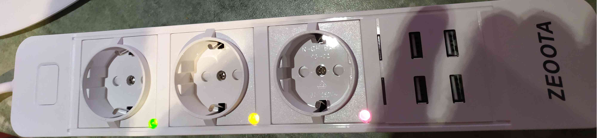

ESP8266 & scripts
=================

Software:
---------

C++ source, HTML, Javascript & JSON format.

After four home automation projects carried out over a period of more than 2 years, my natural laziness finally concluded that the effort produced to achieve these implementations (certainly, operational) is not reasonable.

After long negotiations, I therefore proposed the idea of a new project which could perhaps allow, in the long term, to implement other achievements at lower cost ...

The idea is therefore to produce a generic microcode which would accept as input a script written in a very basic language and which, after processing and formatting (we are not yet talking about "compilation"), would make it possible to describe the process to be processed.

Here, for example, script performing the basic function of flashing a LED:

"SetGPIO (2, OUTPUT_DOWN); if GPIO(2) then timer(Off, 2500) fi; if timer(Off) then !GPIO(2) + clearTimer(Off) + timer(On, 1000); if timer(On) then GPIO(2) + clearTimer(On); "

Formatting this script ("scriptCompiler.sh <blink.esp"), before transmission to the microcontroller, gives:

"S2,0;|~2?TOff,2500;|TOff?!~2 TOff TOn,1000;TOn?~2 TOn;"

This could be placed on a "script server" (nodeJS), indexed to the identifier of the microcontroller; each time it is started, the microcontroller would interrogate the script server in order to retrieve the description of the process assigned to it.

The code below, not yet fully finalized, already seems to almost complete the tasks of my last two projects after loading each of the corresponding scripts ...

In addition, this script server could also, if necessary, act as host of the WEB user interfaces allowing to control the process of each of the microcontrollers by means of script commands, thereby making the embedded microcode much lighter...

And, why not, these interfaces could also allow to edit all or part of the scripts ...

Http requests available:
<table>
  <tr>
    <td><tt>http://IPAddress</tt></td>
    <td>WEB User Interface</td>
  </tr>
  <tr>
    <td><tt>http://IPAddress/setConf?mqttBroker=mosquitto.home.lan</tt></td>
    <td>(*) set the mqtt broker, ... (available in WEB UI)</td>
  </tr>
  <tr>
    <td><tt>http://IPAddress/script?cmd=$5on,1</tt></td>
    <td>set pin 5 (see `script`.esp)</td>
  </tr>
  <tr>
    <td><tt>http://IPAddress/script?cmd=$5off,1</tt></td>
    <td>unset pin 5 (see `script`.esp)</td>
  </tr>
  <tr>
    <td><tt>http://IPAddress/restart</tt></td>
    <td>save status and reboot the device</td>
  </tr>
</table>

(*): "setConf" commands allow access to everything that cannot be modified with scripts...

Screenshots:

